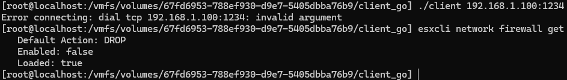
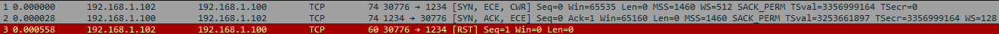

# Client-Server
This repository is created to test the different ways a client on ESXi would behave to connect to a server.

Currently when a user tries to connect to an ESXi hypervisor, the following problem will occur. Even though the firewall has been completely shut down.

This happens because the client cannot finish the three-way-handshake as shown below:

This is a problem that occurs in:
```go
conn, err := net.Dial("tcp", address)
```
The way Golang handles TCP connections differs from the way ESXi expects. Even when the binary is statically compiled.