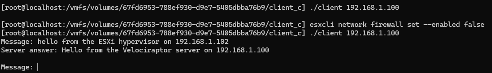

# Client-Server
This repository is created to test the different ways a client on ESXi would behave to connect to a server.

## C
When the ESXi hypervisor tries to run the C client to connect to the server, it can connect, but only when the firewall is either down or has a rule that allows the port the client connects to to have a connection to the outside world.


## Golang
Currently when the ESXi hypervisor tries to run the Golang client to connect to the server, the following problem will occur. Even though the firewall has been completely shut down.

This happens because the client cannot finish the three-way-handshake as shown below:

This is a problem that occurs in:
```go
conn, err := net.Dial("tcp", address)
```
The way Golang handles TCP connections differs from the way ESXi expects. Even when the binary is statically compiled.